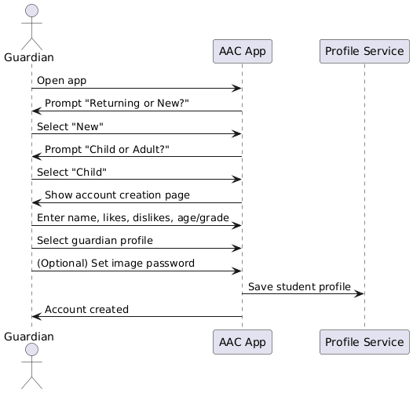
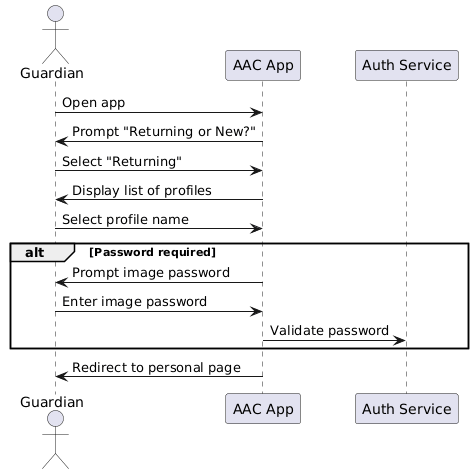
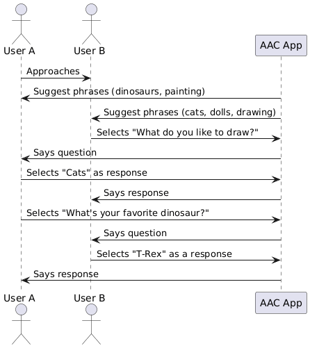
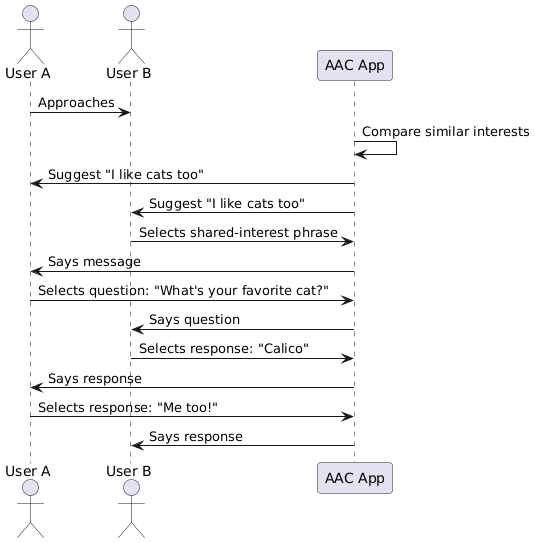
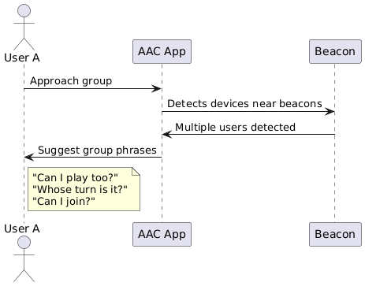

**Purpose**

The Design Document - Part I Architecture describes the software architecture and how the requirements are mapped into the design. This document will be a combination of diagrams and text that describes what the diagrams are showing.

**Requirements**

In addition to the general requirements the Design Document - Part I Architecture will contain:

A description the different components and their interfaces. For example: client, server, database.

For each component provide class diagrams showing the classes to be developed (or used) and their relationship.

Sequence diagrams showing the data flow for _all_ use cases. One sequence diagram corresponds to one use case and different use cases should have different corresponding sequence diagrams. (FINISHED)

Describe algorithms employed in your project, e.g. neural network paradigm, training and training data set, etc.

If there is a database:

Entity-relation diagram.

Table design.

A check list for architecture design is attached here [architecture\_design\_checklist.pdf](https://templeu.instructure.com/courses/106563/files/16928870/download?wrap=1 "architecture_design_checklist.pdf")  and should be used as a guidance.

# Use-Case Sequence Diagrams
## Use Case 1: Admin Profile

## Use-Case 2: Student Account Creation

## Use-Case 3: Student Log-in

## Use-Case 4: 1-on-1 Social Interaction

## Use-Case 5: Relatability

## Use-Case 6: Group Interaction

## Use-Case 7: Setting Goals

