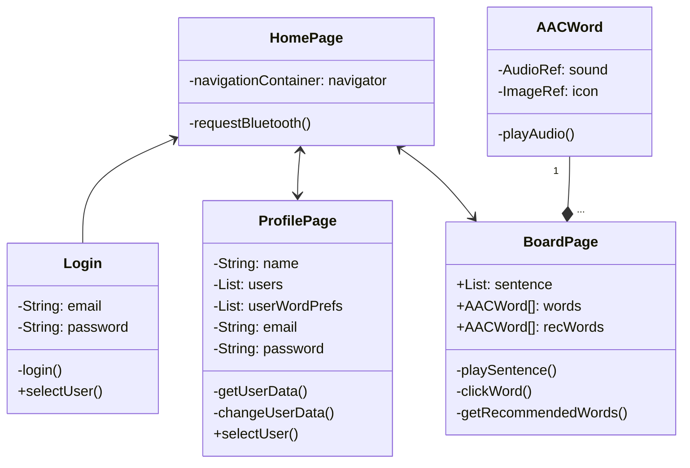
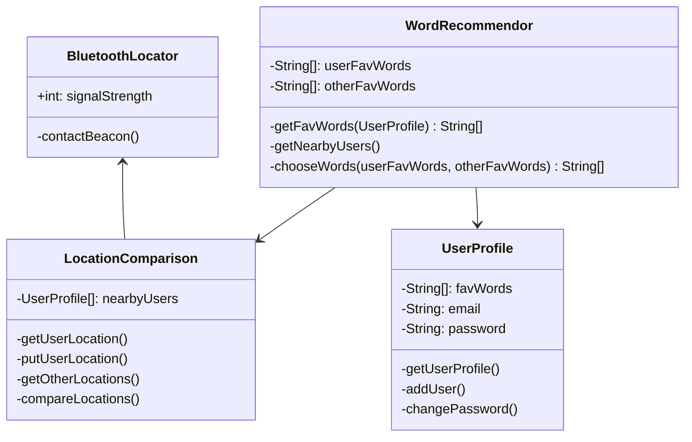

**Purpose**

The Design Document - Part I Architecture describes the software architecture and how the requirements are mapped into the design. This document will be a combination of diagrams and text that describes what the diagrams are showing.

**Requirements**

In addition to the general requirements the Design Document - Part I Architecture will contain:

A description the different components and their interfaces. For example: client, server, database.

For each component provide class diagrams showing the classes to be developed (or used) and their relationship.

Sequence diagrams showing the data flow for _all_ use cases. One sequence diagram corresponds to one use case and different use cases should have different corresponding sequence diagrams. (FINISHED)

Describe algorithms employed in your project, e.g. neural network paradigm, training and training data set, etc.

If there is a database:

Entity-relation diagram.

Table design.

A check list for architecture design is attached here [architecture\_design\_checklist.pdf](https://templeu.instructure.com/courses/106563/files/16928870/download?wrap=1 "architecture_design_checklist.pdf")  and should be used as a guidance.

# Component Class Diagrams
## Frontend

This component will be built out in React Native, and must meet functional requirements that allow a user to click a word (or more accurately an icon) on the AAC board and hear the sound of that word. A series of these words should then be able to connect into a sentence that can also be played. Other functional requirements that must be met by the frontend include the ability to ***see*** the recommended words, select a user under a specific administrator, update profile (ideally restricted to administrator via login) to include favorite words, and allow navigation for use both with and without bluetooth connection.

## Backend

The backend serves other functional purposes, primarily as a driver to access user data such as location (via BluetoothLocator) and profile info (via UserProfile). It is interfacing with our databases at various points to store, access, and change data. This is also primarily where we are selecting the words to recommend comparing different user preferences. This choice is then served to the frontend, which displays the socially aware words in a special container.

# Use-Case Sequence Diagrams
## Use Case 1: Admin Profile

## Use-Case 2: Student Account Creation

## Use-Case 3: Student Log-in

## Use-Case 4: 1-on-1 Social Interaction

## Use-Case 5: Relatability

## Use-Case 6: Group Interaction

## Use-Case 7: Setting Goals

